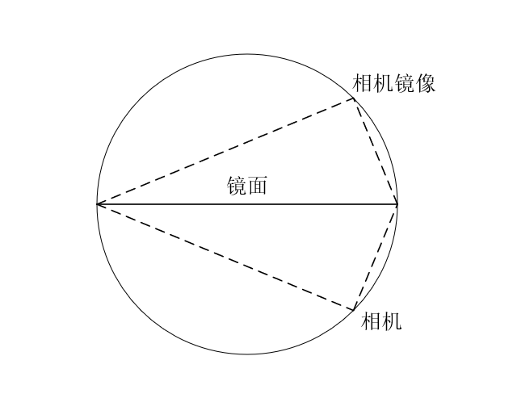

# 倒影效果

## 基本原理

> 倒影也是日常生活中非常常见的现象。但是不幸的是，目前我们使用的Phong模型是局部光照模型，并不能形成倒影（阴影也照样不行），但能实现镜面高光。但这实际上十分违反直觉——*镜面高光让人们以为材质是镜面的，但它却无法产生倒影*。

为了解决这个问题，还是采用像阴影贴图一样的操作逻辑。根据基本的光学知识，我们知道我们在镜中看到的像与我们站在与镜面对称的位置看到的物体的像是一样的。同时，光路具有可逆性，因此光源也必须关于镜面对称过来。摄像机在镜面对称位置拍摄，并将所得图像存入帧缓存，作为纹理传递给银幕的着色器。

唯一需要关注的是纹理坐标的问题。摄像机拍摄的是从镜面背后看到的完整的图像，但镜面的大小是有限的。因此，镜面可能无法显示全部的纹理，这需要我们特别处理。

## 设计思路

> 产生倒影的方法和[阴影贴图](./阴影贴图.html)中是类似的。唯一需要关注的是，在生成倒影的纹理的过程中，不能渲染镜面本身。显然，在镜面的背后观察物体，镜面就会把物体全部挡住，从而无法成像。另外，在生成阴影所需的深度信息时我们不需要引入光照信息，但在这里需要引入它们。因为如果不加入光照，镜像就没有真实感了。
>
> 综上所述，倒影纹理的产生实际上就是将摄像机放在镜面后面，进行一次和标准的成像过程一模一样的成像。
>

### 局限性

同阴影一样，我们所做的一切都是在局部光照模型中试图模拟全局光照的效果，但这些模拟都不可能是完美的。例如，我们的这一模型只能计算一次反射——也就是说，如果猫模型也是镜面的，那我们就看不到它的表面上对镜面的倒影，除非再进行一次渲染。

另一方面，这一渲染同阴影一样开销巨大。阴影的开销巨大体现在对帧缓存的分辨率要求较高，稍低的分辨率就会导致阴影模糊或是充满锯齿。而镜面反射对帧缓存的分辨率没有那么高的要求，我使用了`512*512`大小的帧缓存就能取得十分不错的效果，而阴影即使使用`1024*1024`的帧缓存，在一切情况下看上去依然有些失真。

但是倒影需要和渲染显示的内容一样的光照等信息，至少应该保证不会产生违和感，这点开销比阴影中的计算深度值要大许多。因此游戏和3D应用中，对于镜面的处理，或是采用静态的环境贴图的方法，或是使用分辨率很低的帧缓存来渲染，以提高效率。

### 裁切纹理

*摄像机在镜面背后看到的东西并不一定能从镜面中看到，因为镜面的大小是有限的。*

因此，我们在银幕上使用镜面的纹理时，也需要按照实际情况对纹理进行裁切。在实现本程序的时候，我还是采取了一个取巧的方法，我让相机在以银幕中心为圆形，半径为50的球体上运动，相机的视角恰好是90°，而银幕本身的大小是`100*100`。这也就意味着，镜子背后的相机所能看到的范围恰好是我们能从镜子上看到的范围，如下图所示。



当然，这样的做法并不精确，并且还会产生一些问题，但对于本程序来说，其效果是可以接受的。

### 求镜面对称

在我们的程序中，显然不需要很复杂的算法，因为镜面，即银幕是一块无法移动的平面，并且平行于xy平面。我们只需设置`z=100-z`即可求出对称点位置。但是如果该平面可以移动呢？我们可以在平面上任意找一点，求摄像机位置和该点连线与法向量的投影，并将该投影乘二，并与相机位置相加就可得到所求的点。

## 具体实现

计算倒影的着色器和主着色器一致，因此跳过着色器介绍。

需要注意的是，虽然着色器代码一致，但还是需要初始化新的着色器程序，否则WebGL会在渲染时报错。

```javascript
//...
var mirrorProgramInfo=twgl.createProgramInfo(gl, ["vertex-shader", "fragment-shader"]);

//...

function rander(){
    //...
    //绘制反射帧
    twgl.bindFramebufferInfo(gl,fbi3);
    gl.clear(gl.COLOR_BUFFER_BIT | gl.DEPTH_BUFFER_BIT);
    gl.useProgram(mirrorProgramInfo.program);
    twgl.setUniforms(mirrorProgramInfo,light_uniform);
    cat_uniforms.uMVPFromLight=tempMat1;
    twgl.setBuffersAndAttributes(gl, mirrorProgramInfo, catBufferInfo);
    twgl.setUniforms(mirrorProgramInfo, light_uniform);
    twgl.setUniforms(mirrorProgramInfo, cat_uniforms);
    twgl.setUniforms(mirrorProgramInfo, projection_uniforms);
    twgl.setUniforms(mirrorProgramInfo, view_uniforms);

    camera=camera_uniform.u_viewWorldPosition.slice();	//使用切片避免影响原有数据
    camera[2]=100-camera[2];
    var view=twgl.m4.lookAt(camera,[0,0,50],[0,1,0]);
    var lightPos=light_uniform.uLightPos.slice();
    lightPos[2]=100-lightPos[2];
    var d={
        uView:twgl.m4.inverse(view),
        u_viewWorldPosition:camera,
        uLightPos:lightPos,
    }
    twgl.setUniforms(mirrorProgramInfo, d);
    twgl.drawBufferInfo(gl, catBufferInfo);
    //...
}
```

